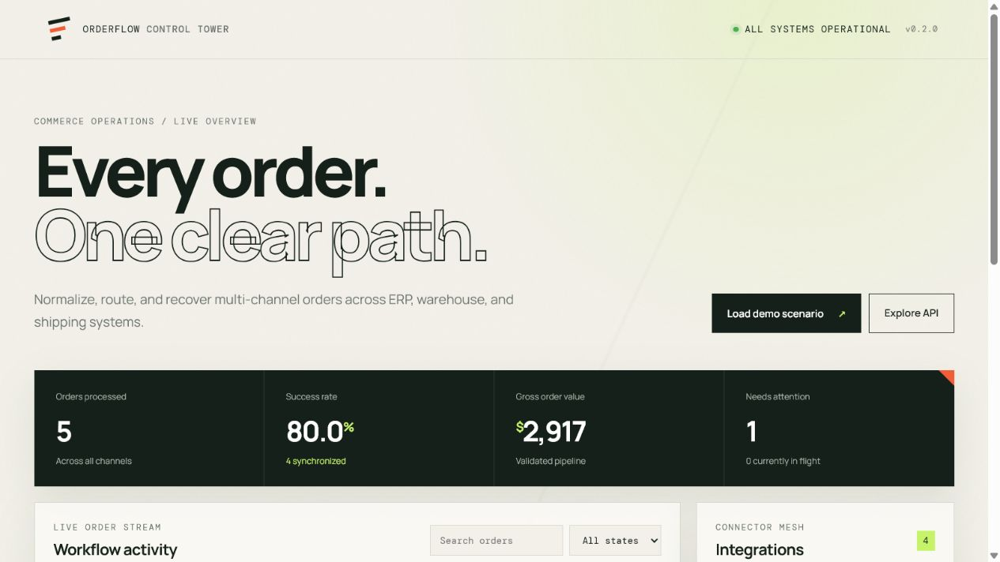
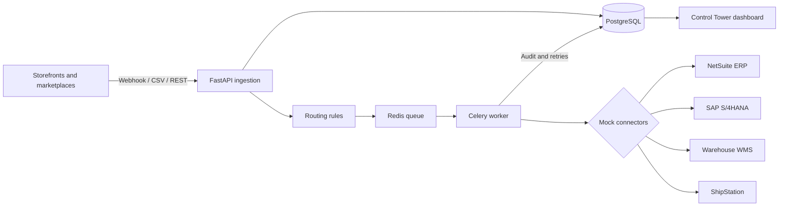

# OrderFlow Integrator

[](https://github.com/hunterinvariants/orderflow-integrator/actions/workflows/ci.yml)
[](https://www.python.org/)
[](https://www.docker.com/)

A portfolio-ready order integration control tower that normalizes commerce orders, applies configurable routing rules, delivers them through background workers, and exposes failures through a polished operations dashboard.



## Business scenario

A merchant receives orders from Shopify, Amazon, Magento, and B2B sales channels. OrderFlow validates each payload, chooses the correct ERP, warehouse, or shipping connector, and records every decision in a durable audit trail. Failed deliveries are retried automatically and remain visible for manual recovery.

## Highlights

- PostgreSQL persistence with SQLAlchemy 2 and Alembic migrations
- Redis-backed Celery worker with exponential retry behavior
- Deterministic mock NetSuite, SAP S/4HANA, ShipStation, and WMS connectors
- Priority-based routing by channel, destination, and order value
- API-key-protected webhook ingestion and bulk CSV imports
- Searchable responsive dashboard with metrics, failures, and live routing state
- Five-order demo scenario, including a deliberate dead-letter example
- Health/readiness probes, non-root Docker image, and persistent volumes
- Isolated integration tests and GitHub Actions CI with Docker build verification
- Render Blueprint for a public web service, worker, PostgreSQL, and Key Value service

## Architecture



## Run the complete stack

```bash
git clone https://github.com/hunterinvariants/orderflow-integrator.git
cd orderflow-integrator
docker compose up --build -d
```

For hosts with legacy Compose v1:

```bash
docker-compose up --build -d
```

Open the dashboard at `http://localhost:8000` and OpenAPI at `http://localhost:8000/docs`. The container applies migrations and loads demo data automatically. The demo is idempotent, so restarts do not duplicate orders.

Check the stack:

```bash
docker-compose ps
curl http://localhost:8000/health
curl http://localhost:8000/ready
```

## Demo workflow

The included scenario demonstrates four successful paths and one repeatable failure:

| Order | Source | Routing result | Outcome |
|---|---|---|---|
| `SHOP-10481` | Shopify | NetSuite ERP | Synchronized |
| `AMZ-77429` | Amazon | Warehouse WMS | Synchronized |
| `B2B-93018` | Salesforce | SAP, because value exceeds $1,000 | Synchronized |
| `SHOP-10482` | Shopify | ShipStation | Synchronized |
| `FAIL-2207` | Magento | Warehouse WMS | Failed and retryable |

Reload the scenario at any time:

```bash
curl -X POST http://localhost:8000/v1/demo/seed
```

## API examples

Create an order:

```bash
curl -X POST http://localhost:8000/v1/orders \
  -H "Content-Type: application/json" \
  -d '{
    "external_order_id": "SHOP-20001",
    "source_system": "shopify",
    "destination_system": "shipping",
    "customer_id": "customer-88",
    "items": [{"sku": "SKU-RED", "quantity": 2, "unit_price": "29.95"}]
  }'
```

Send an authenticated webhook:

```bash
curl -X POST http://localhost:8000/v1/webhooks/orders \
  -H "X-API-Key: demo-orderflow-key" \
  -H "Content-Type: application/json" \
  -d @order.json
```

Import the included CSV:

```bash
curl -X POST http://localhost:8000/v1/orders/import \
  -F "file=@examples/demo-orders.csv"
```

## Main endpoints

| Method | Endpoint | Purpose |
|---|---|---|
| `GET` | `/` | Operations dashboard |
| `GET` | `/health` and `/ready` | Runtime and database checks |
| `GET` | `/v1/metrics` | Aggregated workflow metrics |
| `GET/POST` | `/v1/orders` | List and create orders |
| `POST` | `/v1/orders/{id}/route` | Apply a rule or explicit connector |
| `POST` | `/v1/orders/{id}/retry` | Requeue a failed delivery |
| `POST` | `/v1/orders/import` | Import orders from CSV |
| `POST` | `/v1/webhooks/orders` | Authenticated webhook ingestion |
| `GET` | `/v1/routing-rules` | Inspect decision rules |
| `GET` | `/v1/integrations` | Inspect connector capabilities |

## Local development

```bash
python -m pip install -e ".[dev]"
python -m alembic upgrade head
python -m app.seed
uvicorn app.main:app --reload
```

Run verification:

```bash
python -m compileall -q app tests
python -m pytest
```

SQLite is the zero-configuration local default. Docker Compose automatically uses PostgreSQL and Redis.

## Configuration

Copy `.env.example` to `.env` when running outside Compose. Change `ORDERFLOW_API_KEY` before exposing the service publicly. Connector implementations are deterministic mocks designed to demonstrate integration architecture without third-party credentials.

## Public deployment

The included `render.yaml` provisions the web application, Celery worker, managed PostgreSQL database, and Key Value service as a Render Blueprint.

1. Sign in to Render and create a new Blueprint.
2. Connect `hunterinvariants/orderflow-integrator`.
3. Confirm the resources from `render.yaml`.
4. After deployment, use the generated `onrender.com` URL as the GitHub repository website.

The worker uses a paid Starter instance because Render does not offer free background workers. For a zero-cost presentation, deploy only the web service and use the synchronous API paths, or keep the complete Docker Compose deployment on your Ubuntu host.

## Portfolio positioning

This project demonstrates backend architecture, workflow automation, data modeling, async processing, failure recovery, API design, frontend delivery, containerization, testing, and deployment infrastructure in one reviewable repository.

Suggested Fiverr service title:

> I will build custom order, ERP, warehouse, and shipping integrations
